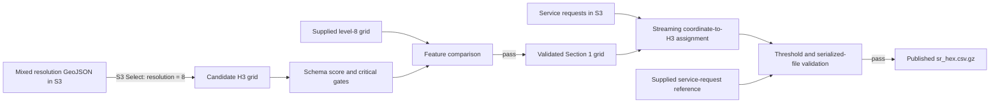

# YearBeyond Data Systems Lead technical assessment

This repository is Tumelo Lungile's Data Engineering submission based on the
[City of Cape Town Data Science Unit code challenge](https://github.com/cityofcapetown/ds_code_challenge).
The submission covers:

- Section 0: Setup
- Section 1: Data Extraction
- Section 2: Initial Data Transformation

The pipeline extracts resolution-8 H3 polygons using AWS S3 Select and checks
their schema and reference agreement. It then assigns an H3 index to each
service request with usable coordinates. Requests with missing coordinates
receive `0`. The saved output is checked against the supplied reference.

## Quick start

### Requirements

- Git
- Python 3.12 (developed and verified with Python 3.12.14)
- Internet access to the public challenge files in `af-south-1`

The pipeline uses the challenge's supplied read-only credentials, which it
retrieves at runtime. A personal AWS account is not required. Credential values
are neither logged nor saved to disk.

### Windows PowerShell

```powershell
git clone https://github.com/tumelolungilebf-rgb/ds_code_challenge.git
cd ds_code_challenge
python --version
python -m venv .venv
.venv\Scripts\python.exe -m pip install -e .
.venv\Scripts\python.exe -m yearbeyond_pipeline
```

The version check must report Python 3.12.x. If `python` is not available on
Windows, use `py -3.12` or the full path to a Python 3.12 executable for the
version-check and virtual-environment commands. In PowerShell, a quoted
executable path needs the call operator: `& "C:\path\to\python.exe" --version`.

### Linux or macOS

```bash
git clone https://github.com/tumelolungilebf-rgb/ds_code_challenge.git
cd ds_code_challenge
python3.12 -m venv .venv
.venv/bin/python -m pip install -e .
.venv/bin/python -m yearbeyond_pipeline
```

The final command runs Section 1 and then Section 2 without interactive input.
It exits with status `0` only when both sections pass. Section 2 is skipped if
Section 1 fails, because it depends on the validated grid produced by Section 1.

To run a single section from the same environment:

```powershell
.venv\Scripts\yearbeyond-section1.exe
.venv\Scripts\yearbeyond-section2.exe
```

Section 2 requires the local grid produced by Section 1. On Linux or macOS,
use `.venv/bin/yearbeyond-section1` and `.venv/bin/yearbeyond-section2`.
The installed commands
`yearbeyond-pipeline`, `yearbeyond-section1` and `yearbeyond-section2` are also
available when the virtual environment is activated.

## Source files

All four files are in S3 bucket `cct-ds-code-challenge-input-data`, region
`af-south-1`. The pipeline reads them automatically.

| File | Use |
| --- | --- |
| `city-hex-polygons-8-10.geojson` | Section 1 input containing resolutions 8, 9 and 10 |
| `city-hex-polygons-8.geojson` | Reference for the extracted resolution-8 grid |
| `sr.csv.gz` | Section 2 input containing service requests |
| `sr_hex.csv.gz` | Reference for the transformed service requests |

## Pipeline overview



Each section writes a temporary dataset and replaces the final file after
validation passes. A validation failure leaves the previous dataset in place
and returns a nonzero exit status. Files are replaced individually, so a run
can be interrupted between replacements. Check the latest pipeline summary
and stage reports before using the outputs.

## Section 1: data extraction

The pipeline executes this S3 Select query against
`city-hex-polygons-8-10.geojson`:

```sql
SELECT *
FROM S3Object[*].features[*] AS s
WHERE s.properties.resolution = 8
```

Validation uses the standalone contract in
[`config/h3_level8_schema.json`](config/h3_level8_schema.json). Six equally
weighted rules produce a percentage conformance score. The minimum is 99.5%.
Feature structure, H3 validity, resolution and polygon structure must also pass
without errors. Duplicate H3 indices fail the run.

The extracted features are also compared by H3 index with
`city-hex-polygons-8.geojson`. This detects missing, extra, duplicate and changed
features without relying on feature order.

Verified live result:

| Measure | Result |
| --- | ---: |
| Resolution-8 features | 3,832 |
| Schema checks passed | 22,992 / 22,992 |
| Conformance score | 100% |
| Critical failures | 0 |
| Missing, extra or changed reference features | 0 |
| Bytes scanned by S3 Select | 108,254,980 |
| Bytes returned | 2,011,878 |
| Final-review clean-clone Section 1 time | 4.138 seconds |

The output GeoJSON was reproduced with SHA-256:

```text
83c8a05b4f9b3528892ee75968b01f4fd4986f4bfc0e1c06d2f382b8671e489b
```

Detailed rationale and evidence are in
[`docs/section1_design.md`](docs/section1_design.md) and
[`docs/section1_results.md`](docs/section1_results.md).

## Section 2: initial transformation

The transformation reads `sr.csv.gz` one row at a time. It:

1. Preserves the 15 named source fields as text and in source order.
2. Assigns `0` when either coordinate is empty.
3. Rejects nonnumeric, nonfinite or out-of-range nonempty coordinates.
4. Calculates the resolution-8 address with
   `h3.latlng_to_cell(latitude, longitude, 8)`.
5. Checks membership in the validated Section 1 grid.
6. Derives any missing H3 cell and records it in a separate audit file. The
   request remains counted as a failed match against the original grid.
7. Reopens the temporary gzip and compares every serialized field and row with
   `sr_hex.csv.gz` before publication.

Three requests fall in two valid H3 cells absent from the supplied grid. The
pipeline derives these cells from the coordinates using the pinned H3 library.
It saves their boundaries separately and retains the Section 1 grid unchanged.
The reference dataset is used only to validate the output.

### Join error policy

The standalone policy is
[`config/section2_policy.json`](config/section2_policy.json).

| Gate | Calculation | Maximum | Observed |
| --- | --- | ---: | ---: |
| Original-grid unjoined | Sum of missing, invalid and outside-grid rows, divided by all rows | 25% | 22.553030% |
| Unexpected join error | Sum of invalid and outside-grid rows, divided by nonmissing rows | 0.001% | 0.000411% |

The 25% limit allows for the measured missing-location rate and some headroom.
The 0.001% limit allows at most seven unexpected rows at the observed
nonmissing-row count; eight would fail. Malformed coordinates and reference H3
mismatches fail the run regardless of these limits. Both thresholds are
documented project choices based on source inspection.

Verified live result:

| Measure | Result |
| --- | ---: |
| Source and serialized reference rows | 941,634 each |
| Missing coordinate pairs assigned `0` | 212,364 |
| Usable coordinate pairs | 729,270 |
| Requests in the original grid | 729,267 |
| Outside-grid requests recovered | 3 |
| Identity, H3, shared-field or length mismatches | 0 |
| Final-review clean-clone Section 2 time | 62.070 seconds |

Two complete standalone runs produced the same gzip SHA-256:

```text
2724a0eea1007a5e16fd0a8037a95ffedb76e94735d768b4d4a1fd51635fabd0
```

Detailed rationale, exploratory evidence and production results are in
[`docs/section2_design.md`](docs/section2_design.md),
[`docs/section2_probe.json`](docs/section2_probe.json) and
[`docs/section2_results.md`](docs/section2_results.md).

## Generated outputs and logging

Generated data and logs are excluded from Git because they are reproducible
from the public inputs.

| Path | Purpose |
| --- | --- |
| `data/processed/city-hex-polygons-8.geojson` | Validated Section 1 grid |
| `data/processed/sr_hex.csv.gz` | Validated Section 2 service requests |
| `outputs/section1_validation.json` | Schema, reference, source and timing evidence |
| `outputs/section2_validation.json` | Join, threshold, reference, hash and timing evidence |
| `outputs/section2_supplemental_cells.geojson` | Audited grid coverage gaps |
| `outputs/pipeline_summary.json` | Overall status and links between stage runs |
| `outputs/pipeline.log` | Structured JSON event log |

Logs contain UTC timestamps, stage durations, aggregate counts, thresholds,
source object metadata and output hashes. They exclude credentials, raw service
request rows and notification identifiers.

## Testing

Run the full test suite after installation:

```powershell
.venv\Scripts\python.exe -m unittest discover -s tests -v
```

On Linux or macOS, replace `.venv\Scripts\python.exe` with
`.venv/bin/python`.

The current suite contains 34 tests covering S3 event-stream handling, schema
score boundaries, critical validation gates, reference differences, coordinate
categories, H3 assignments, join threshold boundaries, deterministic gzip
serialization, malformed CSV records, safe publication and full-pipeline
orchestration. Tests use small synthetic data; full supplied datasets are used
for live validation.

## Reproducibility choices

- `.python-version` records Python 3.12.14; `pyproject.toml` restricts execution
  to Python 3.12 and pins direct runtime dependencies.
- External inputs and challenge credentials are retrieved programmatically.
- Source size, ETag and last-modified metadata are checked before and after each
  live stage to detect a source changing during execution.
- GeoJSON features are sorted before deterministic JSON serialization.
- CSV output uses stable row order and gzip metadata for byte-for-byte repeat
  output with unchanged sources and dependency versions.
- Standalone JSON configuration files separate validation policy from code.
- Generated datasets, logs, environments and secrets are excluded by
  [`.gitignore`](.gitignore).

The final clean-clone run passed both sections in 66.779 seconds. Runtime
depends on network and service conditions. The initial run is recorded in
[`docs/clean_clone_verification.md`](docs/clean_clone_verification.md). The
latest verification and operating limits are in
[`docs/final_review.md`](docs/final_review.md).

## Project structure

```text
config/                       validation contracts and thresholds
docs/                         design decisions and measured results
scripts/                      source-access and exploratory inspection tools
src/yearbeyond_pipeline/      installable extraction/transformation package
tests/                        standard-library unittest suite
AI_log.md                     required record of AI-assisted work
pyproject.toml                package metadata, commands and dependencies
```

AI-assisted development is documented in [`AI_log.md`](AI_log.md), including
requests, models, generated work, corrections and verification.

The original challenge statement and Sections 3-6 remain available in the
[upstream repository](https://github.com/cityofcapetown/ds_code_challenge).
