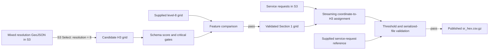

# YearBeyond Data Systems Lead technical assessment

This repository is Tumelo Lungile's Data Engineering submission based on the
[City of Cape Town Data Science Unit code challenge](https://github.com/cityofcapetown/ds_code_challenge).
The agreed scope is limited to:

- Section 0: Setup
- Section 1: Data Extraction
- Section 2: Initial Data Transformation

Sections 3-6 are outside this submission and have not been implemented.

The solution extracts resolution-8 H3 polygons with AWS S3 Select, validates
them with a graded schema contract, assigns every service request to an H3 cell,
and checks the serialized result against the supplied reference dataset.

## Quick start

### Requirements

- Git
- Python 3.12 (developed and verified with Python 3.12.14)
- Internet access to the public challenge files in `af-south-1`

A personal AWS account is not required. The pipeline downloads the challenge's
supplied read-only dummy credentials at runtime. It does not print or save those
credentials, and no secrets are committed to this repository.

### Windows PowerShell

```powershell
git clone https://github.com/tumelolungilebf-rgb/ds_code_challenge.git
cd ds_code_challenge
python --version
python -m venv .venv
.venv\Scripts\python.exe -m pip install -e .
.venv\Scripts\python.exe -m yearbeyond_pipeline
```

The version check must report Python 3.12.x. If `python` is not available on
Windows, use `py -3.12` or the full path to a Python 3.12 executable in the
first two commands.

### Linux or macOS

```bash
git clone https://github.com/tumelolungilebf-rgb/ds_code_challenge.git
cd ds_code_challenge
python3.12 -m venv .venv
.venv/bin/python -m pip install -e .
.venv/bin/python -m yearbeyond_pipeline
```

The final command runs Section 1 and then Section 2 without interactive input.
It exits with status `0` only when both sections pass. Section 2 is skipped if
Section 1 fails, because it depends on the validated grid produced by Section 1.

Installed console commands are also available:

```text
yearbeyond-pipeline   # complete Sections 1-2 pipeline
yearbeyond-section1   # Section 1 only
yearbeyond-section2   # Section 2 only; requires a validated local grid
```

## Pipeline overview



Both sections write to temporary files and publish final artifacts only after
their required validations pass. A failed run preserves any previous successful
output and returns a nonzero exit status.

## Section 1: data extraction

The pipeline executes this S3 Select query against
`city-hex-polygons-8-10.geojson`:

```sql
SELECT *
FROM S3Object[*].features[*] AS s
WHERE s.properties.resolution = 8
```

Validation uses the standalone contract in
[`config/h3_level8_schema.json`](config/h3_level8_schema.json). Six equally
weighted rules produce a non-binary conformance score. The required score is
99.5%, with separate critical gates for structure, H3 validity, resolution and
polygon geometry. Passing the score cannot hide a critical failure.

The extracted features are also compared by H3 index with
`city-hex-polygons-8.geojson`. This detects missing, extra, duplicate and changed
features without relying on feature order.

Verified live result:

| Measure | Result |
| --- | ---: |
| Resolution-8 features | 3,832 |
| Schema checks passed | 22,992 / 22,992 |
| Conformance score | 100% |
| Critical failures | 0 |
| Missing, extra or changed reference features | 0 |
| Bytes scanned by S3 Select | 108,254,980 |
| Bytes returned | 2,011,878 |
| Latest unified-run Section 1 time | 3.701 seconds |

The output GeoJSON was reproduced with SHA-256:

```text
83c8a05b4f9b3528892ee75968b01f4fd4986f4bfc0e1c06d2f382b8671e489b
```

Detailed rationale and evidence are in
[`docs/section1_design.md`](docs/section1_design.md) and
[`docs/section1_results.md`](docs/section1_results.md).

## Section 2: initial transformation

The transformation streams `sr.csv.gz`; it does not load 941,634 row
dictionaries into a dataframe. For each row it:

1. Preserves the 15 named source fields as text and in source order.
2. Assigns `0` when either coordinate is empty.
3. Rejects nonnumeric, nonfinite or out-of-range nonempty coordinates.
4. Calculates the resolution-8 address with
   `h3.latlng_to_cell(latitude, longitude, 8)`.
5. Checks membership in the validated Section 1 grid.
6. Derives and separately audits a valid H3 cell missing from that supplied
   grid, while keeping the original grid failure visible.
7. Reopens the temporary gzip and compares every serialized field and row with
   `sr_hex.csv.gz` before publication.

The supplied grid omits two valid H3 cells used by three requests. The pipeline
discovers these cells dynamically, derives their boundaries using the pinned H3
library, and writes them to a supplemental audit artifact. It never copies the
answer from the reference dataset and does not modify the Section 1 grid.

### Join error policy

The standalone policy is
[`config/section2_policy.json`](config/section2_policy.json).

| Gate | Calculation | Maximum | Observed |
| --- | --- | ---: | ---: |
| Original-grid unjoined | missing + invalid + outside-grid rows / all rows | 25% | 22.553030% |
| Unexpected join error | invalid + outside-grid rows / nonmissing rows | 0.001% | 0.000411% |

The 25% gate allows the measured missing-location rate while detecting a large
increase or broken column mapping. The 0.001% gate permits at most seven
unexpected rows at the observed eligible-row count; eight would fail. Any
malformed coordinate fails independently, even below these percentage limits.
Reference H3 differences also have a separate zero-tolerance gate.

Verified live result:

| Measure | Result |
| --- | ---: |
| Source and serialized reference rows | 941,634 each |
| Missing coordinate pairs assigned `0` | 212,364 |
| Usable coordinate pairs | 729,270 |
| Requests in the original grid | 729,267 |
| Outside-grid requests recovered | 3 |
| Identity, H3, shared-field or length mismatches | 0 |
| Latest unified-run Section 2 time | 59.300 seconds |

Two complete standalone runs produced the same gzip SHA-256:

```text
2724a0eea1007a5e16fd0a8037a95ffedb76e94735d768b4d4a1fd51635fabd0
```

Detailed rationale, exploratory evidence and production results are in
[`docs/section2_design.md`](docs/section2_design.md),
[`docs/section2_probe.json`](docs/section2_probe.json) and
[`docs/section2_results.md`](docs/section2_results.md).

## Generated outputs and logging

Generated data and logs are excluded from Git because they are reproducible
from the public inputs.

| Path | Purpose |
| --- | --- |
| `data/processed/city-hex-polygons-8.geojson` | Validated Section 1 grid |
| `data/processed/sr_hex.csv.gz` | Validated Section 2 service requests |
| `outputs/section1_validation.json` | Schema, reference, source and timing evidence |
| `outputs/section2_validation.json` | Join, threshold, reference, hash and timing evidence |
| `outputs/section2_supplemental_cells.geojson` | Audited grid coverage gaps |
| `outputs/pipeline_summary.json` | Overall status and links between stage runs |
| `outputs/pipeline.log` | Structured JSON event log |

Logs contain UTC timestamps, stage durations, aggregate counts, thresholds,
source object metadata and output hashes. They exclude credentials, raw service
request rows and notification identifiers.

## Testing

Run the full test suite after installation:

```powershell
.venv\Scripts\python.exe -m unittest discover -s tests -v
```

On Linux or macOS, replace `.venv\Scripts\python.exe` with
`.venv/bin/python`.

The current suite contains 32 tests covering S3 event-stream handling, schema
score boundaries, critical validation gates, reference differences, coordinate
categories, H3 assignments, join threshold boundaries, deterministic gzip
serialization, safe publication and full-pipeline orchestration. Tests use
small synthetic data; full supplied datasets are used for live validation.

## Reproducibility choices

- `.python-version` records Python 3.12.14; `pyproject.toml` restricts execution
  to Python 3.12 and pins direct runtime dependencies.
- External inputs and challenge credentials are retrieved programmatically.
- Source size, ETag and last-modified metadata are checked before and after each
  live stage to detect a source changing during execution.
- GeoJSON features are sorted before deterministic JSON serialization.
- CSV output uses stable row order and gzip metadata for byte-for-byte repeat
  output with unchanged sources and dependency versions.
- Standalone JSON configuration files separate validation policy from code.
- Generated datasets, logs, environments and secrets are excluded by
  [`.gitignore`](.gitignore).

The clean-clone unified run passed both sections in 65.552 seconds. Timing is
reported as evidence of that run, not as a general performance benchmark. The
complete check is recorded in
[`docs/clean_clone_verification.md`](docs/clean_clone_verification.md).

## Project structure

```text
config/                       validation contracts and thresholds
docs/                         design decisions and measured results
scripts/                      source-access and exploratory inspection tools
src/yearbeyond_pipeline/      installable extraction/transformation package
tests/                        standard-library unittest suite
AI_log.md                     required record of AI-assisted work
pyproject.toml                package metadata, commands and dependencies
```

AI assistance is disclosed in [`AI_log.md`](AI_log.md), including prompts,
models, validation, user corrections and assistant corrections. Exact token
counts were unavailable in the interface and are identified as unavailable
rather than estimated.

The original challenge statement and Sections 3-6 remain available in the
[upstream repository](https://github.com/cityofcapetown/ds_code_challenge).
